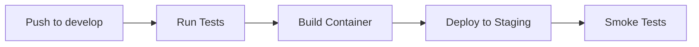
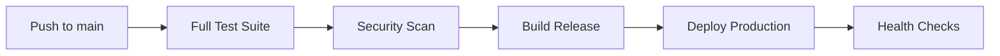

# RSMT CI/CD Integration Guide

This document outlines the comprehensive CI/CD pipeline integrated into the RSMT codebase reorganization.

## 🎯 Overview

The CI/CD integration provides:
- **Automated Testing**: Unit, integration, and performance tests
- **Code Quality**: Linting, formatting, type checking, security scans
- **Documentation**: Automated docs building and deployment
- **Packaging**: PyPI and Docker image publishing
- **Deployment**: Staging and production deployments
- **Pre-commit Hooks**: Local quality checks before commits

## 🔧 CI/CD Components

### 1. GitHub Actions Workflows

#### Main CI/CD Pipeline (`.github/workflows/ci-cd.yml`)
- **Triggers**: Push to main/develop/test_harness, PRs, releases
- **Matrix Testing**: Python 3.8-3.11 on Ubuntu/Windows/macOS
- **GPU Testing**: Optional GPU-specific tests
- **Performance Benchmarks**: Automated performance tracking
- **Security Scanning**: Vulnerability detection
- **Docker**: Multi-architecture container builds

#### Release Pipeline (`.github/workflows/release.yml`)
- **Automated Releases**: Tag-triggered or manual releases
- **PyPI Publishing**: Automatic package distribution
- **Docker Registry**: Multi-platform container images
- **GitHub Releases**: Automated release notes and artifacts

### 2. Pre-commit Hooks (`.pre-commit-config.yaml`)

Local quality checks run before each commit:

```yaml
# Code formatting and linting
- black (code formatting)
- isort (import sorting)
- flake8 (linting)
- mypy (type checking)

# Security and quality
- bandit (security scanning)
- safety (dependency security)
- detect-secrets (secret detection)

# General file checks
- trailing whitespace
- end-of-file-fixer
- check-yaml/json/toml
- check-merge-conflict

# Documentation
- prettier (markdown/yaml formatting)
- doc link checking

# RSMT-specific checks
- import validation
- migration tool validation
- pattern checking
```

### 3. Containerization (`Dockerfile`)

Multi-stage Docker builds:
- **Development**: Full dev environment with tools
- **Production**: Optimized runtime image
- **GPU**: CUDA-enabled variant for GPU workloads

### 4. Code Quality Tools

#### Pattern Checker (`tools/code_quality/check_patterns.py`)
- Validates RSMT-specific coding patterns
- Checks for prohibited imports and deprecated functions
- Enforces naming conventions
- AST-based analysis for complex patterns

#### Documentation Checker (`tools/code_quality/check_docs.py`)
- Validates markdown links and references
- Checks internal file references
- Verifies image paths and alt text
- External URL accessibility testing

#### Test Runner (`tools/testing/run_tests.py`)
- Comprehensive test execution
- Multiple test categories (unit, integration, performance)
- Coverage reporting
- Results aggregation and reporting

### 5. Development Environment Setup (`scripts/setup_dev.py`)

Automated development environment configuration:
- Dependency installation
- Pre-commit hook setup
- IDE configuration (VS Code)
- Environment file templates
- Development scripts creation

## 🚀 Getting Started with CI/CD

### 1. Local Development Setup

```bash
# Setup development environment
python scripts/setup_dev.py

# Install pre-commit hooks
pre-commit install
pre-commit install --hook-type commit-msg

# Run all quality checks
pre-commit run --all-files
```

### 2. Testing Locally

```bash
# Quick test suite
python tools/testing/run_tests.py --quick

# Full test suite with coverage
python tools/testing/run_tests.py --verbose --save-results test_results.json

# Specific test categories
python tools/testing/run_tests.py --unit-only
python tools/testing/run_tests.py --quality-only
```

### 3. Code Quality Checks

```bash
# Check coding patterns
python tools/code_quality/check_patterns.py

# Check documentation
python tools/code_quality/check_docs.py

# Format code
black rsmt/ scripts/ tests/ tools/
isort rsmt/ scripts/ tests/ tools/

# Type checking
mypy rsmt/

# Security scan
bandit -r rsmt/
```

### 4. Building Documentation

```bash
cd docs
make html
make linkcheck  # Verify links
```

### 5. Container Development

```bash
# Build development container
docker build --target development -t rsmt:dev .

# Build production container
docker build --target production -t rsmt:prod .

# Build GPU container
docker build --target gpu -t rsmt:gpu .

# Run development container
docker run -it -v $(pwd):/app rsmt:dev bash
```

## 📊 CI/CD Pipeline Details

### Testing Strategy

| Test Category | Scope | Duration | Frequency |
|---------------|-------|----------|-----------|
| **Unit Tests** | Individual functions/classes | 2-5 min | Every commit |
| **Integration Tests** | Component interactions | 5-15 min | Every PR |
| **Performance Tests** | Benchmarks & profiling | 10-30 min | Scheduled |
| **GPU Tests** | GPU-specific functionality | 5-20 min | On request |
| **Migration Tests** | Reorganization validation | 2-10 min | Every commit |

### Quality Gates

Before code reaches main branch:
1. ✅ All unit tests pass
2. ✅ Code coverage ≥ 80%
3. ✅ No linting errors
4. ✅ Type checking passes
5. ✅ Security scan clean
6. ✅ Documentation builds
7. ✅ Performance within tolerance

### Deployment Pipeline

#### Staging (develop branch)


#### Production (main branch)


## 🔐 Security and Compliance

### Automated Security Checks
- **Bandit**: Python security linting
- **Safety**: Dependency vulnerability scanning
- **Trivy**: Container image scanning
- **Secret Detection**: Prevent credential leaks

### Compliance Features
- **Audit Logs**: All CI/CD activities logged
- **Reproducible Builds**: Exact dependency versions
- **Security Baselines**: Established security thresholds
- **Access Controls**: Role-based deployment permissions

## 📈 Monitoring and Metrics

### Performance Tracking
- **Benchmark Trends**: Automated performance regression detection
- **Test Duration**: Track test execution time trends
- **Build Times**: Monitor CI/CD pipeline performance
- **Coverage Trends**: Code coverage over time

### Quality Metrics
- **Code Quality Score**: Aggregated quality metrics
- **Technical Debt**: Track code complexity and issues
- **Documentation Coverage**: API documentation completeness
- **Security Score**: Security vulnerability trends

## 🛠️ Customization and Extension

### Adding New Tests

1. **Unit Tests**: Add to `tests/unit/`
2. **Integration Tests**: Add to `tests/integration/`
3. **Performance Tests**: Add to `tests/benchmark/`
4. **GPU Tests**: Add to `tests/gpu/`

### Custom Quality Checks

Add new checks to `tools/code_quality/`:
```python
def check_custom_pattern(file_path: Path) -> List[Dict[str, Any]]:
    # Custom pattern checking logic
    pass
```

### Pipeline Modifications

Modify `.github/workflows/ci-cd.yml`:
```yaml
- name: Custom Check
  run: |
    python tools/custom_check.py
```

### Environment Configuration

Add environment variables:
```yaml
env:
  CUSTOM_SETTING: value
```

## 🎯 Best Practices

### Commit Guidelines
- Use conventional commits: `feat:`, `fix:`, `docs:`, etc.
- Keep commits small and focused
- Include tests with new features
- Update documentation for user-facing changes

### Pull Request Process
1. Create feature branch from `develop`
2. Make changes with tests
3. Run local quality checks: `pre-commit run --all-files`
4. Submit PR with clear description
5. Address CI/CD feedback
6. Merge after approval and green CI

### Release Process
1. Update version in `pyproject.toml` and `rsmt/__init__.py`
2. Update `CHANGELOG.md`
3. Create release tag: `git tag v1.0.0`
4. Push tag: `git push origin v1.0.0`
5. GitHub Actions handles the rest

## 🚨 Troubleshooting

### Common Issues

#### Pre-commit Hooks Failing
```bash
# Update pre-commit hooks
pre-commit autoupdate

# Run specific hook
pre-commit run black --all-files

# Skip hooks temporarily (not recommended)
git commit -m "message" --no-verify
```

#### Test Failures
```bash
# Run tests with more verbose output
python tools/testing/run_tests.py --verbose

# Run specific test
pytest tests/unit/test_specific.py -v

# Debug test with pdb
pytest tests/unit/test_specific.py --pdb
```

#### Docker Build Issues
```bash
# Build with no cache
docker build --no-cache -t rsmt:dev .

# Check build logs
docker build -t rsmt:dev . 2>&1 | tee build.log

# Interactive debugging
docker run -it --entrypoint=/bin/bash rsmt:dev
```

#### CI/CD Pipeline Issues
- Check GitHub Actions logs
- Verify environment variables
- Check branch protection rules
- Validate secrets and permissions

## 📚 Additional Resources

### Documentation
- [GitHub Actions Documentation](https://docs.github.com/en/actions)
- [Pre-commit Documentation](https://pre-commit.com/)
- [Docker Best Practices](https://docs.docker.com/develop/dev-best-practices/)
- [PyPI Publishing Guide](https://packaging.python.org/guides/publishing-package-distribution-releases-using-github-actions-ci-cd-workflows/)

### Tools and Services
- [Codecov](https://codecov.io/) - Code coverage reporting
- [Dependabot](https://dependabot.com/) - Dependency updates
- [Snyk](https://snyk.io/) - Security vulnerability scanning
- [GitHub Security](https://github.com/features/security) - Repository security features

---

This CI/CD integration ensures that the RSMT codebase maintains high quality, security, and reliability while enabling rapid development and deployment.
